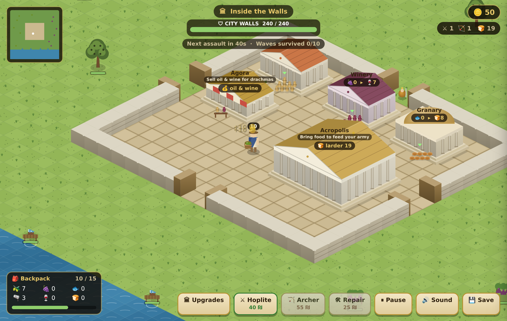

# Aegis of Athens — v2 (isometric, character-driven)



A ground-up reimagining of the game as a **third-person, character-driven**
experience: you walk an Athenian around an isometric world, out through the
city gates to gather resources in the countryside, back inside to the workshops
to process them, and to the Agora to sell — the *Last Asylum* "go out, gather,
haul it home" loop. Then you hire soldiers and hold the walls against Sparta.

This is the **actively-developed** version; the original tap-to-gather game at
`../index.html` is kept as a reference.

## The loop at a glance
1. Walk out through any of the **four gates** into the countryside.
2. Gather olives 🫒, grapes 🍇 and fish 🐟 into your **backpack**.
3. Haul them home and **drop them at the workshops** — the Olive Press, Winery
   and Granary turn them into oil, wine and food, which **pile up as stacks**
   beside each building.
4. Carry oil & wine to the **Agora** to sell for **drachmas**; bring food to the
   **Acropolis** to feed your army.
5. Spend drachmas on **upgrades, porters and soldiers**.
6. **Hold the walls** against escalating Spartan assaults — slain Spartans drop
   **coins** you scoop up for more drachmas. Survive 10 waves to win.

The **gates** let you (and your porters) in and out on every side, but the
Spartans can never pass them — they batter the walls from outside.

## Status

- **Phase 1 — Isometric engine + traversal ✅**
  - Isometric projection, diamond tile ground (grass / city stone / sea)
  - Camera that follows the character and clamps to the map
  - Floating **virtual joystick** (touch) + WASD/arrow keys (desktop)
  - Player movement with wall/building **collision** and slide
  - A walled city with a working **gate** you pass through
  - Depth-sorted rendering (walls, buildings, trees, character)
  - Inside/outside-the-walls awareness
- **Phase 2 — Gather & carry ✅**
  - Countryside **harvest nodes** — olive groves, vineyards, fishing docks —
    with regenerating stock; walk up to auto-gather
  - **Backpack** with capacity: per-resource counts, a carry bubble over the
    character's head, a HUD meter, and a "full — take it home" prompt
  - **Deposit** raw resources by standing at the matching workshop
    (olives→Press, grapes→Winery, fish→Granary); buffers shown on each building
  - The sea is now impassable — you fish from the shore
- **Phase 3 — Make & sell on foot ✅**
  - Workshops **process** their input buffer into finished goods over time
    (olives→oil, grapes→wine, fish→food); each shows `input ▸ output`
  - **Pick up** finished goods by standing at the workshop — the backpack now
    holds raw resources *and* goods (two-row HUD)
  - **Sell** oil, wine & food at the **Agora** for **drachmas**, shown in a
    top-right coin purse with `+₪` floaters
  - Completes the full loop: gather → haul → process → haul → sell
- **Phase 4 — Siege reworked ✅ (this build)**
  - **Spartan waves** march from the north and batter the **city walls**
    (which have HP, damage tinting, and a HUD bar); a breach ends the game
  - Hire **hoplites ⚔ & archers 🏹** (bottom-right dock) who auto-defend the
    ramparts — archers loose arrows, hoplites hold the line
  - **You can fight too**: a spear auto-strikes nearby Spartans; you have
    health, and being caught outside during a raid can knock you back to the
    city (dropping half your load)
  - **Food feeds the army** — deliver food to the Acropolis to stock the
    larder; an empty larder starves soldiers into deserting
  - Escalating waves, drachma rewards per wave, and a **win at 10 waves**;
    end-game modal with Play Again
- **Phase 5 — Progression & polish ✅ (this build)**
  - **Upgrade shop** (slide-in panel): bigger backpack, faster movement,
    faster workshops (press/winery/granary), and stronger city walls
  - **Porters — the idle layer**: hire *Gatherer* porters that auto-harvest
    and stock the workshops, and *Merchant* porters that auto-sell finished
    goods at the Agora; they roam the map on their own
  - **Minimap** (top-left) showing the city, nodes, porters, Spartans and you
  - **Save / load** to localStorage with autosave and resume-on-reload
  - **Sound**: synthesised WebAudio SFX for coins, hits and the war-horn

The v2 game is now feature-complete across all five phases — a full
character-driven loop: gather → haul → process → sell → upgrade → defend.

- **Art pass ✅**
  - Textured ground: grassy fields with tufts, marble-paved city, animated sea
  - Greek temples with stepped stylobates, fluted columns, entablature and
    terracotta gabled roofs (domed granary, awninged agora, grand Acropolis)
  - Richer resource nodes (layered olive groves, trellised vineyards, fishing
    docks with nets, crates & fish) and a detailed Athenian character
  - **Resource stacks**: finished goods pile up beside a workshop as amphorae
    of oil, wine jars and loaves of bread — a visual "come collect me" cue with
    a bobbing arrow — plus growing input piles and a basket the character and
    porters visibly carry, filled by their load
- **Quality-of-life ✅**
  - **Gates on all four sides** you can walk in and out of; the Spartans are
    held at the wall line and can never pass through
  - **Slain Spartans drop coins** that slide toward you — scoop them up for
    extra drachmas to spend on upgrades
  - **Clear building roles**: every building shows its name, a one-line job
    ("Sell oil & wine for drachmas", "Bring food to feed your army") and a live
    status tag, so the Agora and Acropolis explain themselves
  - Easier early pacing: first assault at 70s, more time between waves, faster
    gathering and a bigger backpack
- **Polish pass (from a design + code review) ✅**
  - **Onboarding**: a short scripted tutorial with a **waypoint arrow** that
    guides a new player through gather → drop → collect → sell
  - **Tighter loop**: near-instant early processing and the Agora moved into
    the workshop cluster, so selling is a few steps instead of a cross-city trek
  - **Pause & mute** buttons; decluttered building labels (the full role line
    shows only when you're nearby); fixed a HUD/label overlap
  - Coins left on the field are **auto-salvaged when a wave clears** (no need to
    run into the kill zone)
  - Fixes: enemies can no longer clip through walls/gates while chasing;
    merchant porters & the Agora no longer sell the army's food; reinforcing the
    walls adds HP instead of being a free full repair

## Run it

```bash
python3 -m http.server 8000   # from the repo root
# then open http://localhost:8000/v2/
```

**Controls:** drag anywhere to walk (a joystick appears under your thumb), or
use **W A S D** / arrow keys. Head south through the gate to reach the
countryside.

## Files

```
v2/
  index.html        # full-viewport canvas
  style.css
  js/
    config.js       # map layout, walls, gate, buildings, player tuning
    world.js        # iso projection, camera, tile map, collision, draw helpers
    player.js       # character entity: movement, collision, facing
    input.js        # virtual joystick + keyboard
    render.js       # isometric renderer (depth-sorted, zero image assets)
    main.js         # canvas sizing + game loop
```
